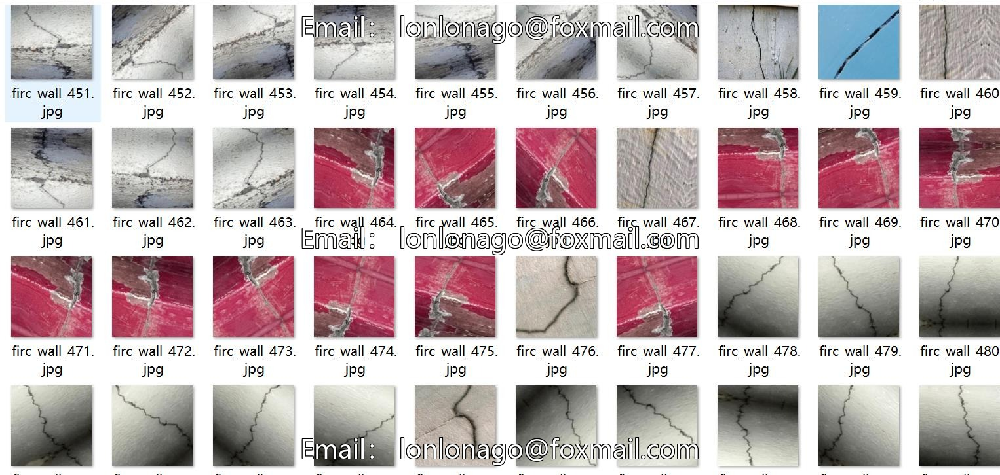
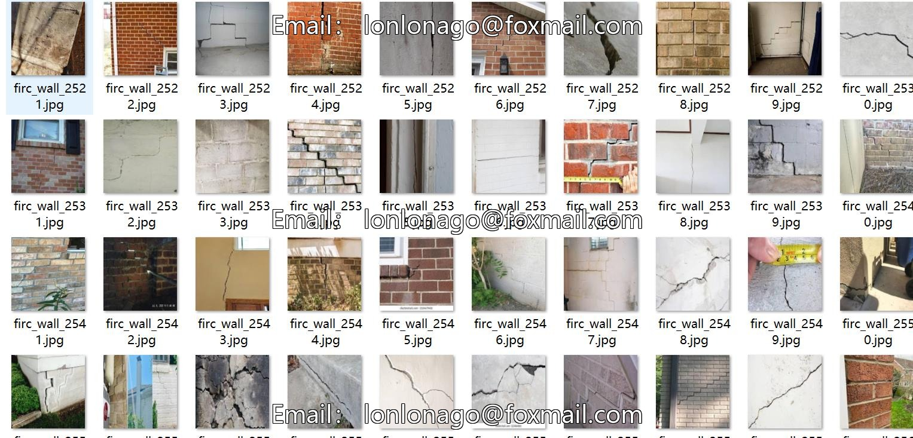
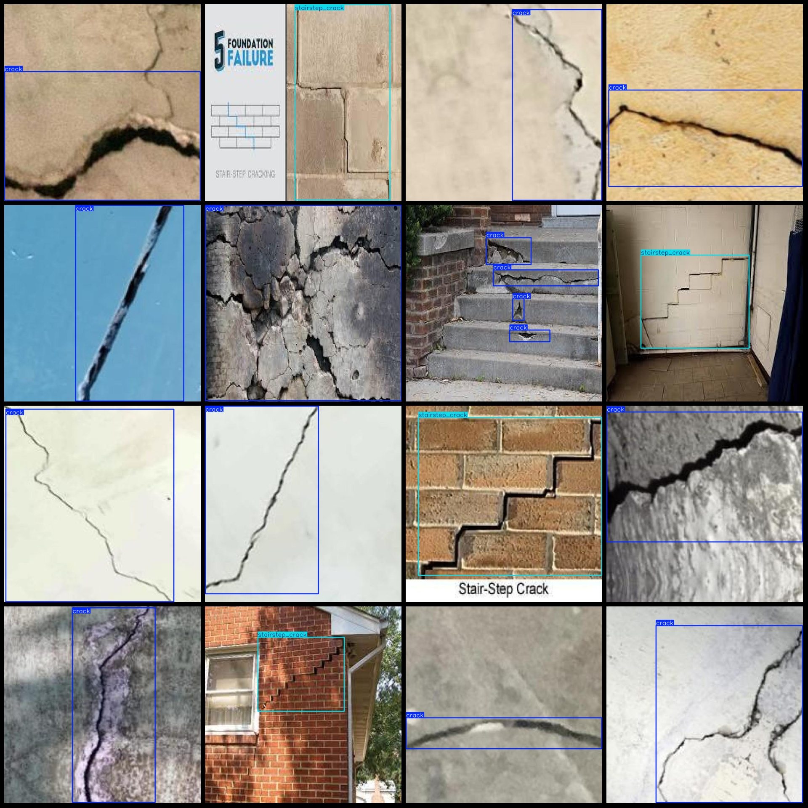
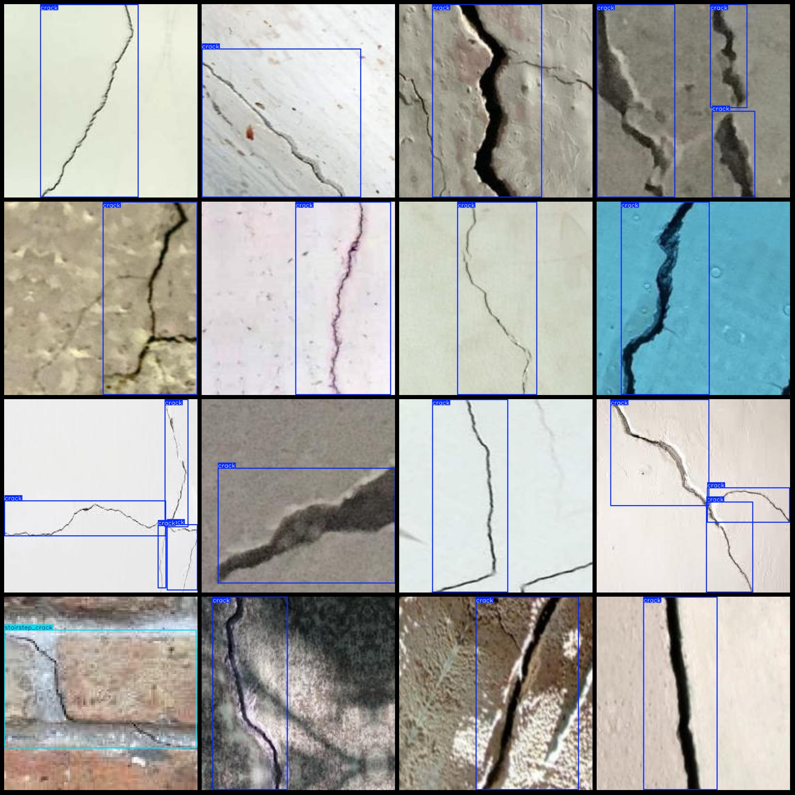

# Building Wall Wall Cracks Mold Peeling Paint Water Leakage Detection Dataset VOC+YOLO Format with 2920 Images in 5 Categories

Dataset format: Pascal VOC format + Yolo format (txt file without split path, only contain jpg images and corresponding VOC format xml files and YOLO format txt files)
Number of images (jpg file count): 2920
Number of annotations (xml file count): 2920
Number of annotations (txt file count): 2920
Number of annotation categories: 5
Annotation category names (Note that the order of categories in the Yolo format is not consistent with this, but according to the labels folder classes.txt): ["crack", "mold", "peeling_paint", 
"stairstep_crack", "water_seepage"]
Number of bounding boxes for each category:
crack (cracks) = 2773
mold (mould) = 134
peeling_paint (paint peeling) = 306
stairstep_crack (stair step crack) = 311
water_seepage (water seepage) = 149
Total bounding box count: 3673
Image resolution: 640x640
Annotation tool used: labelImg
Annotation rules: draw bounding boxes for categories
Important note: No specific statement provided
Special declaration: This dataset does not guarantee the accuracy of the trained model or weight files.
Image preview:

## Picture

Here is a pay link on Stripe ( https://buy.stripe.com/3cs8yP7sY87d0vu9AB ). Please contact me lonlonago@foxmail.com after funding $89, and I will send you a complete data files , thank you!

